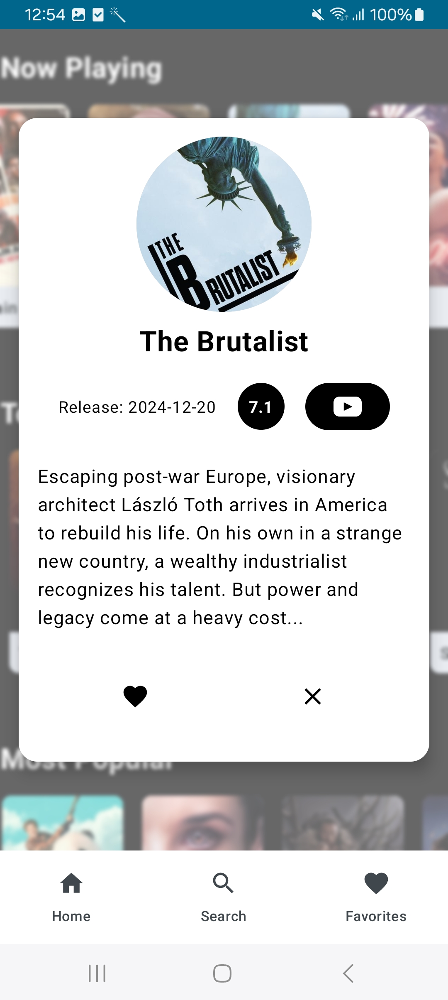

# MovieLib 🎬

MovieLib is a modern Android app built with **Jetpack Compose** that allows users to explore movies, view details, save favorites, and watch trailers. It leverages the power of **Clean Architecture, MVVM, and Paging 3** to deliver a seamless user experience.

## 🛠️ Tech Stack

- **Kotlin**: Primary programming language.
- **Jetpack Compose**: Modern UI toolkit for building native Android UIs.
- **MVVM Architecture**: Separation of concerns for maintainability.
- **Clean Architecture**: Scalable and testable code structure.
- **Retrofit**: For networking and API calls.
- **Room Database**: Local database for storing favorite movies.
- **Hilt**: Dependency injection for better code organization.
- **Paging 3**: Efficiently load and display paginated data.
- **Glide**: Image loading library for Compose.

## 🎯 Key Features

- **Discover Movies**: Browse top-rated, popular, and now-playing movies.
- **Search**: Find movies by title or keywords.
- **Movie Details**: View detailed information about a movie, with navigation to YT to watch the trailer.
- **Favorites**: Save movies to watch later.
- **Swipe-to-Delete**: Easily remove movies from favorites.

## 🚀 API Used

MovieLib uses **The Movie Database (TMDb) API** to fetch movie data.\
[Learn more about TMDb API](https://developer.themoviedb.org/docs/getting-started)

## 📸 Screenshots

| Home Screen | Movie Details | Search Movies | Favurites |
| --- | --- | --- | --- |
|  |  |  |  | 

###

